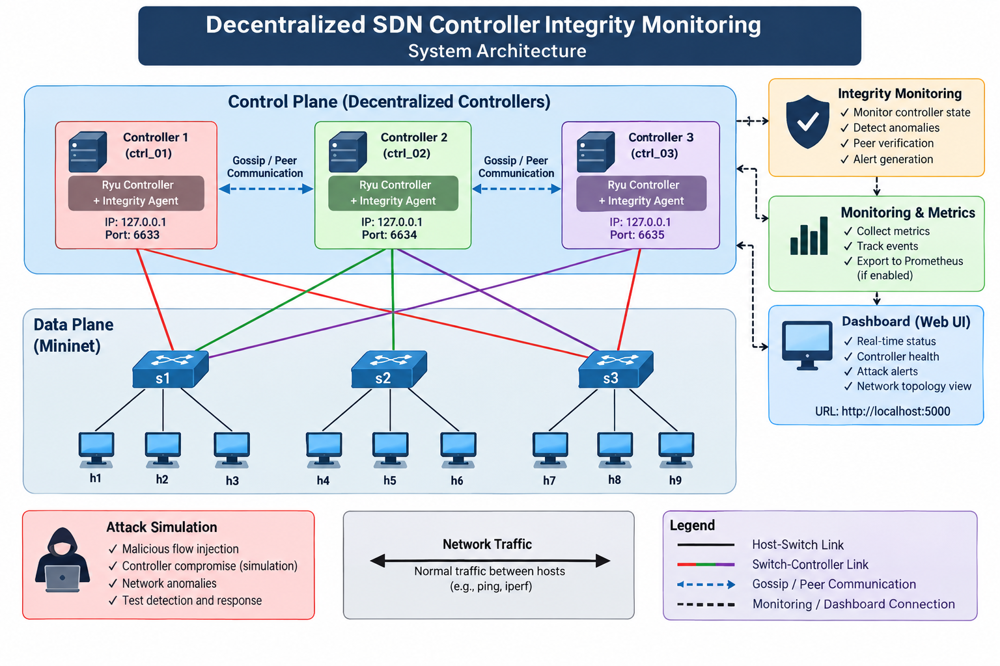
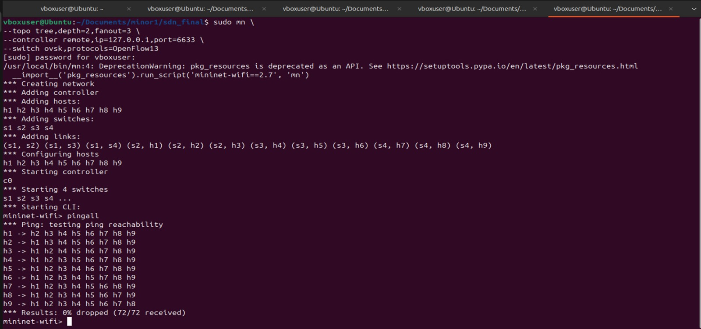
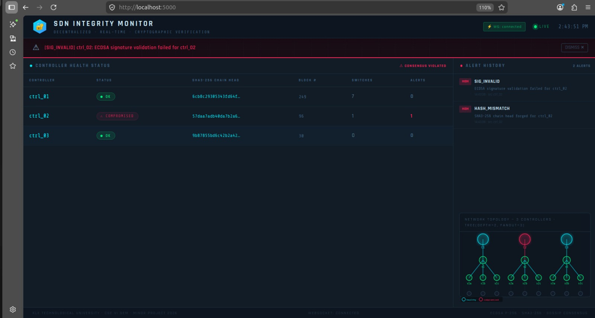

# Decentralized SDN Controller Integrity Monitoring


A distributed SDN security system that monitors the integrity of three Ryu controllers in real time. Each controller maintains a SHA3-256 hash chain of its own state, signs each block with an ECDSA P-256 key, and broadcasts it to the other two controllers via a push-gossip protocol. Peers verify signatures, track freshness, and run a 2-of-3 majority consensus with no central coordinator.

---

## Architecture







```
                    CONTROL PLANE

  ctrl_01 (OF :6633, gossip :9101)
  ctrl_02 (OF :6634, gossip :9102)
  ctrl_03 (OF :6635, gossip :9103)

  Each controller gossips its signed state to the other two every 5 s.
  All three write to /tmp/sdn_state.json (atomic replace).
  The dashboard reads that file and pushes updates to the browser over WebSocket.

                    DATA PLANE (Mininet)

  h1 h2 h3          h4 h5 h6          h7 h8 h9
     |                  |                  |
     s1 -------------- s2 -------------- s3

  s1: ctrl_01 (primary), ctrl_02 (backup)
  s2: ctrl_02 (primary), ctrl_03 (backup)
  s3: ctrl_03 (primary), ctrl_01 (backup)

  Linear chain s1 -- s2 -- s3, 9 hosts total (h1-h9).
  Every switch is registered with two controllers for redundancy.
```

### Core components

| Module | Purpose |
|--------|---------|
| `integrity/chain.py` | SHA3-256 chained block structure |
| `integrity/signer.py` | ECDSA P-256 key management, sign, verify |
| `integrity/agent.py` | Hash, sign, alert, consensus engine |
| `gossip/node.py` | Push-gossip client and heartbeat TTL |
| `gossip/server.py` | HTTP server for receiving peer state |
| `monitoring/anomaly.py` | EWMA 3-sigma flood and injection detection |
| `monitoring/audit.py` | Signed append-only audit log |
| `dashboard/app.py` | Flask + Socket.IO real-time dashboard |
| `attacks/simulator.py` | Attack simulation (hash tamper, sig forgery) |

---

## Project Structure

```
sdn_final/
├── controller/
│   └── ryu_controller.py    L2 MAC-learning switch with integrity agent and gossip
├── integrity/
│   ├── agent.py             Core engine: hash, sign, alert, consensus
│   ├── chain.py             SHA3-256 chained block structure
│   └── signer.py            ECDSA P-256 key management
├── gossip/
│   ├── node.py              Push-gossip client + heartbeat TTL
│   └── server.py            HTTP server for receiving peer state
├── dashboard/
│   ├── app.py               Flask + Socket.IO backend
│   └── ui.html              Real-time browser dashboard
├── monitoring/
│   ├── anomaly.py           EWMA statistical anomaly detection
│   ├── audit.py             Signed append-only audit log
│   └── prometheus.py        Prometheus metric definitions
├── attacks/
│   └── simulator.py         Attack simulation (hash tamper, sig forgery, etc.)
├── shared/
│   ├── config.py            Ports, paths, thresholds
│   ├── events.py            Event type constants
│   └── logger.py            Structured logging
├── scripts/
│   ├── setup.sh             One-time install: venv, pip, keys
│   ├── start_multi.sh       Three-controller mode + dashboard
│   ├── start.sh             Single-controller mode (ctrl_01 only)
│   ├── verify.sh            Health-check all running services
│   ├── multi_controller.py  Mininet topology for 3-controller mode
│   └── mininet_topo.py      Alternative single-controller Mininet topology
├── tests/                   Pytest unit tests
├── configs/
│   ├── prometheus.yml       Prometheus scrape config
│   └── default.yaml         Configuration reference
├── keys/                    ECDSA .pem files (auto-generated, git-ignored)
├── logs/                    Runtime logs and audit.jsonl (git-ignored)
├── Dockerfile
├── docker-compose.yml       All 3 controllers + dashboard + Prometheus + Grafana
├── pyproject.toml
└── requirements.txt
```

---

## Requirements

- Linux (Ubuntu 20.04 or 22.04 recommended)
- Python 3.8–3.10 (ryu 4.34 does not support Python 3.11+)
- Mininet and Open vSwitch installed on the host
- Ryu does not run on macOS or Windows

---

## Installation

```bash
git clone https://github.com/JeevanBennur1234/Decentralized-SDN-Controller-Integrity-Monitoring.git
cd sdn_final
bash scripts/setup.sh
```

`setup.sh` creates a virtualenv, installs all Python dependencies, and generates ECDSA key pairs for all three controllers under `keys/`.

---

## Running

### Three-controller mode (recommended)

**Terminal 1 — start controllers and dashboard:**

```bash
bash scripts/start_multi.sh
```

This starts:
- `ctrl_01` on OpenFlow port 6633, gossip port 9101
- `ctrl_02` on OpenFlow port 6634, gossip port 9102
- `ctrl_03` on OpenFlow port 6635, gossip port 9103
- Dashboard on port 5000

Wait until all three controllers are ready before starting Mininet:

```bash
# Each controller logs "All subsystems online" when fully initialised.
# You can watch all three at once:
tail -f logs/ctrl_01.log logs/ctrl_02.log logs/ctrl_03.log

# Or check that all three gossip ports are listening:
ss -tlnH sport = :9101 && ss -tlnH sport = :9102 && ss -tlnH sport = :9103
```

> `start_multi.sh` polls the gossip ports automatically and only prints
> "All services ready" once all three controllers are up.

**Terminal 2 — start the Mininet topology:**

```bash
sudo python3 scripts/multi_controller.py
```

This creates a linear chain `s1 -- s2 -- s3` with 9 hosts. Each switch connects to two controllers:

- `s1`: ctrl_01 (6633), ctrl_02 (6634)
- `s2`: ctrl_02 (6634), ctrl_03 (6635)
- `s3`: ctrl_03 (6635), ctrl_01 (6633)

Inside the Mininet CLI:

```
mininet> pingall
mininet> net
mininet> dump
```

### Single-controller mode

Starts only `ctrl_01` and the dashboard. Useful for testing without Mininet's multi-controller support.

```bash
bash scripts/start.sh
```

Then in a new terminal:

```bash
sudo mn --topo tree,depth=2,fanout=3 \
        --controller remote,ip=127.0.0.1,port=6633 \
        --switch ovsk,protocols=OpenFlow13
```

---

## Verification

```bash
bash scripts/verify.sh
```

Checks HTTP reachability of the dashboard, Prometheus endpoint, and all three gossip servers. Also prints the current state of `/tmp/sdn_state.json` and recent alerts.

### Manual checks

```bash
# Controller logs
tail -f logs/ctrl_01.log logs/ctrl_02.log logs/ctrl_03.log

# Gossip ping
curl http://localhost:9101/gossip/ping
curl http://localhost:9102/gossip/ping
curl http://localhost:9103/gossip/ping

# Dashboard API
curl http://localhost:5000/api/status
curl http://localhost:5000/api/state
```

---

## Tests

```bash
source venv/bin/activate
python3 -m pytest tests/ -v
```

Tests cover the hash chain, ECDSA signer, integrity agent, and anomaly detector. They do not require Mininet or a running Ryu instance.

---

## Attack Simulation

The simulator manipulates `/tmp/sdn_state.json` and `/tmp/sdn_alerts.json` directly to demonstrate detection scenarios. The dashboard must be running.

```bash
source venv/bin/activate

# Target a specific controller
python3 attacks/simulator.py ctrl_01
python3 attacks/simulator.py ctrl_02
python3 attacks/simulator.py ctrl_03

# Target all three in sequence
python3 attacks/simulator.py all

# Clear all alerts and restore healthy state
python3 attacks/simulator.py reset
```

Each run corrupts the target controller's hash and signature for 10 seconds, then automatically restores it. The dashboard shows the `HASH_MISMATCH` and `SIG_INVALID` alerts in real time.

### Detection mechanisms

| Attack | How it is detected |
|--------|--------------------|
| Hash tampering | Local `chain.verify_all()` fails |
| Signature forgery | `verify()` returns False on invalid DER bytes |
| Flow injection | Flow rule rate > 50/s triggers FLOW_INJECT alert |
| Replay / rollback | Block index regression or stale timestamp rejected |
| Controller offline | No gossip heartbeat for > 30 s |
| Packet flood | Packet rate > 500 pps triggers FLOOD alert |

---

## Dashboard

Open `http://localhost:5000` after starting the services.

- Controller table: health status, chain head hash, block height, trust score
- Alert list: type, severity, source, detail, timestamp
- Event stream: switch connect, packet-in, flow-add, gossip events
- Packet rate chart: rolling 2-minute history
- Prometheus metrics: `http://localhost:5000/metrics`

---

## Docker Deployment

```bash
docker compose up --build
```

Starts all three controllers, the dashboard, Prometheus (:9090), and Grafana (:3000). Grafana default credentials: `admin` / `sdn2026`.

`network_mode: host` is required for the controllers so that Mininet (running on the host) can reach the OpenFlow ports. This only works on Linux.

---

## Troubleshooting

**"Unable to contact remote controller" in Mininet**
Start the controllers and wait for `All subsystems online` in the logs before running `multi_controller.py`.

**Dashboard shows an empty table**
`/tmp/sdn_state.json` has not been written yet. Check that `ryu-manager` started without import errors (`tail logs/ctrl_01.log`).

**`ryu-manager` ImportError**
Ryu 4.34 requires Python 3.8–3.10. If you are on 3.11 or later, downgrade to Python 3.10 (`pyenv install 3.10` or use the system package `python3.10`).

**Port already in use**
Run `pkill -f ryu-manager` and `sudo mn -c` to clean up stale processes and OVS state before restarting.

**`flask-socketio` WebSocket errors**
Install `eventlet`: `pip install eventlet`. Socket.IO requires an async worker.

---

## Limitations

- Gossip transport is plain HTTP. A production deployment would use mutual TLS to prevent eavesdropping and MITM on the controller network.
- Consensus is a simple 2-of-3 majority vote. Raft or PBFT would provide stronger guarantees for larger or adversarial deployments.
- No automated remediation: alerts are detected and logged but the system does not take corrective action (e.g. isolating a compromised controller).
- The attack simulator manipulates state files directly; it does not inject real OpenFlow messages or network traffic.
- Tested on a single machine. Multi-host deployment requires adjusting IP addresses in `shared/config.py`.

---

## License

[MIT License](LICENSE)
